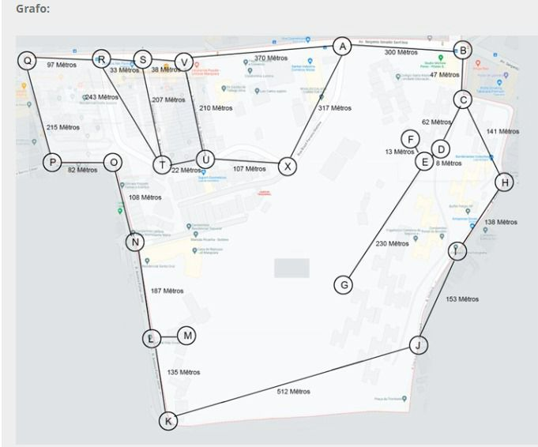

# Mapeamento do Bairro Jardim Taquaral (Santo Amaro) usando Grafos

Esta aplicação Java utiliza a teoria dos grafos para mapear a localização de pontos no bairro Jardim Taquaral (Santo Amaro). Cada vértice representa um ponto de referência, e as arestas armazenam a distância em metros até o próximo ponto.

## Estrutura do Grafo

O grafo é construído da seguinte forma:

- Cada vértice representa um ponto de referência no Jardim Taquaral.
- As arestas são ponderadas com a distância em metros até o próximo ponto de localização.

## Como Executar

1. Compile e execute a classe `Main`.
2. Siga as instruções para fornecer pontos de partida e chegada.
3. O sistema calculará e exibirá os caminhos disponíveis no grafo.

## Referência Visual

